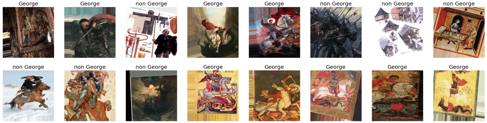

# Transfer-Learning-Test-Project
This  project represents TensorFlow implimentation of CNN binary classifier using transfer learning technique. 
The model allows to distingwish images containing Saint George with accuracy 94.0%. It was trained on Tesla K80 GPU (Kaggle).
## Project structure
* 'load_data.ipynb' file allows to download images and separate them on training and validation datasets (70/30 %).
* 'train_classifier.ipynb' file contains TensorFlow implimentation of the model and its training  process.
* 'pyproject.toml' file contains all required project dependencies.
## Model architecture and training process 
Pretrained on ImageNet dataset Xception model was used as a basis for this binary classifier. The top layer was removed and instead simple Dense layer with one neuron and sigmoid activation was used.
In order to make the model more generalized, a data augmentation technique was used. Below you can see examples of images with augmentation:

During the training process was used the following learning rate schedule (learning rate vs. epoch):
[img2](images/lr_vs_epoch.png)

The following figure display 'loss' and 'accuracy' curnes during training process:
[img3](images/training_curves.png)

## Results
The model scores for accuracy, precision and recall are 94.0, 94.0, and 92.4, respectively.
